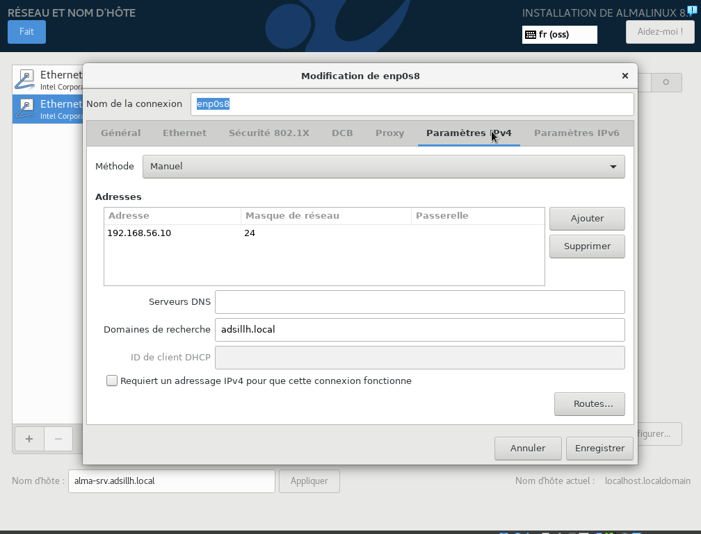

TP1: installation de base, dhcp, dns
====================================

Pour les quelques TPs qui seront présentés, on partira sur une infrastructure relativement simple basée sur Virtual Box.

2 VMs seront principalement utilisées. Une VM serveur et une VM client. Les 2 seront basées sur la distribution AlmaLinux.

L'iso de déploiement utilisée dans les 2 cas est la version minimaliste disponible ici :  [Alma - x86](http://ftp.lip6.fr/pub/linux/distributions/AlmaLinux/8.10/isos/x86_64/) , que j'ai déjà copié sur vos postes dans `/local` pour gagner du temps.

On aura donc :

* Une VM "Serveur" sous Almalinux avec 2 cartes réseaux. Une "NATée" pour accéder à Internet, l'autre sur un sous-réseau hôte, privé, connecté à la VM "Cliente".
  * Cette VM serveur aura l'ip 192.168.56.10/24 sur le réseau privé.
  * Elle fera office de serveur DHCP + DNS
  * On se connecte à cette VM depuis l'hyperviseur en tant qu'utilisateur et on y fait une élévation de droit avec un `su -` (Pas de connexion root@ mais pas de sudo non plus ...)

* Une VM "Cliente" sous Almalinux également. Une seule carte réseau branchée au sous-réseau hôte privé, et un environnement Gnome. Cette VM simulera un poste client connecté au SI.

# Avant toute chose

Utilisez

`mkdir /local/votrelogin`

pour vous faire un répertoire sur le disque local, où vous pourrez déposer toutes vos VMs

# VM "serveur"

## Création

* Lancez Virtual Box
* Bouton `Nouvelle`
* Nom `VM serveur`
* Folder: `/local/votrelogin`
* ISO Image: `/local/AlmaLinux-8.10-X86_64-minimal.iso`
* Cochez `Skip Unattended Installation` pour pouvoir configurer la VM comme voulu
* 2Go de mémoire iront bien.
* Donnez 2 CPUs à la VM pour la rendre plus véloce
* 20Go de disque dur iront bien.
* Bouton `Finish`

# Configuration de la VM "serveur"

Avant de lancer la VM, il faut configurer ses cartes réseau

* Dans `Fichier`, `Outils`, `Network Manager`
* S'il n'y a pas encore de vboxnet0 dans la liste, Cliquer sur créer
* Entrer dans les propriétés du réseau `vboxnet0`
* Désactiver le serveur DHCP (puisqu'on va l'installer nous-même sur le serveur)
* Appliquer

* Bouton `Configuration`, partie `Réseau`
* On laisse la première carte réseau en `NAT` (accès Internet)
* On active la deuxième carte réseau en `Réseau privé hôte`

## Installation

* Bouton `Démarrer`
* Confirmez qu'on veut installer
* L'installeur démarre, on peut sauter l'étape de test de l'image ISO

Il y a plusieurs éléments qu'on doit/veut configurer en particulier:

* Mot de passe Administrateur
  * On peut mettre quelque chose de simple, il suffit de cliquer sur `Fait` en haut à gauche deux fois pour insister.

* Disque dur:
  * Il suffit de rentrer dans la configuration, et cliquer sur `Fait`: puisqu'il y a un seul disque dur, il n'y a pas vraiment de question à se poser :)

* Réseau & nom d'hôte
  * La première carte réseau, on peut la connecter simplement, elle est branchée en NAT vers Internet
    * Dans sa configuration, dans l'onglet `Général`, activez la connexion automatique
  * La deuxième carte réseau, on la connecte aussi, mais dans sa configuration:
    * dans l'onglet `Général`, activez la connexion automatique
    * on bascule en mode manuel,
    * et on ajoute l'adresse 192.168.56.10 à la main:

  
  

* Commencer l'installation
* Cela dure une dizaine de minutes. Pendant ce temps, passez à la création+configuration+installation de la VM "client"
* Terminer en faisant Redémarrer le système

* On arrive sur une bannière de login, vous pouvez essayer de vous logguer en tant que `root`, la VM est installée !

## Post configuration

On va pouvoir se connecter à la VM depuis votre bureau, cela sera bien plus pratique que de passer par la console texte:

```shell
ssh root@192.168.56.10
```

(Si cela ne répond pas, lancer `nmcli con up enp0s8` dans la VM)

C'est cependant déconseillé de laisser `root` se connecter en ssh, il vaut mieux se connecter avec un utilisateur normal. Commençons par le créer dans la VM (on peut aussi utiliser un mot de passe simple, il suffit d'insister):

```shell
# useradd admin
# passwd admin
Changement de mot de passe pour l'utilisateur admin.
Nouveau mot de passe :
Retapez le nouveau mot de passe :
passwd : mise à jour réussie de tous les jetons d'authentification.
```

Et pour pouvoir se connecter en ssh sans avoir à taper le mot de passe, on peut utiliser un clé publique/privée. Depuis votre bureau, utilisez:

```shell
$ ssh-keygen # garder toutes les options par défaut (pas de passphrase) pour simplifier
$ ssh-copy-id admin@192.168.56.10
$ ssh admin@192.168.56.10
```

ce dernier ssh ne devrait rien demander. On verra les détails de ce qui se passe en cours de réseau.

C'est assez pratique d'avoir un raccourci plutôt que taper cela à rallonge. Depuis votre bureau, dans le fichier `$HOME/.ssh/config` (créez-le s'il n'existe pas encore), ajoutez les lignes:

```
Host serveur
    User admin
    HostName 192.168.56.10
```

et ainsi un simple `ssh serveur` suffira !

Et maintenant, une fois connecté en "admin", on peut utiliser

```shell
$ su -
```

(Switch User) pour basculer en `root`

Désactivons maintenant l'accès direct à `ssh` en `root`, en éditant `/etc/ssh/ssh_config`. Commençons par installer un éditeur facile à utiliser, nano:

```shell
# dnf install nano
```

Je vous conseille d'apprendre également à utiliser `vi`, c'est très utile car c'est ce qui est toujours disponible sous Unix !

```shell
# nano /etc/ssh/sshd_config
```

Cherchez (avec control-W, comme documenté en bas de l'écran `^W` qui signifie control-W) la ligne `PermitRootLogin`

Ajoutez un `#` en tête de ligne pour désactiver cette option.

Écrivez le fichier et quittez.

Il faut relancer le démon `ssh` pour prendre en compte la modification:

```shell
# systemctl restart sshd
```

On peut vérifier qu'il a bien redémarré:

```shell
# systemctl status sshd
```

Réessayez de vous connecter en `root@192.168.56.10`, cela ne passe plus !

Vous pouvez passer à la partie du premier exercice

# VM "client"

## Création

C'est comme pour la VM "serveur"

## Configuration

C'est comme pour la VM "serveur" sauf qu'on n'a pas besoin de créer un autre vboxnet0.

## Installation

C'est comme pour la VM "serveur", sauf que pour la deuxième carte réseau, on n'ajoute pas d'adresse à la main, on le fera via dhcp que l'on va installer.

Pendant que la VM s'installe, revenez sur la partie installation et configuration de la VM serveur.

# Si vous avez un souci de réseau

Vérifiez votre configuration: dans `/etc/sysconfig/network-scripts/ifcfg-enp0s3` (la première carte réseau)

```
TYPE=Ethernet
PROXY_METHOD=none
BROWSER_ONLY=no
BOOTPROTO=dhcp
DEFROUTE=yes
IPV4_FAILURE_FATAL=no
IPV6INIT=yes
IPV6_AUTOCONF=yes
IPV6_DEFROUTE=yes
IPV6_FAILURE_FATAL=no
IPV6_ADDR_GEN_MODE=eui64
NAME=enp0s3
UUID=dacd9599-a254-4fc4-ad1b-e80d3956173b    # ou toute autre valeur
DEVICE=enp0s3
ONBOOT=yes
```

Et dans `/etc/sysconfig/network-scripts/ifcfg-enp0s8` (la deuxème carte réseau), sur le serveur:

```
TYPE=Ethernet
PROXY_METHOD=none
BROWSER_ONLY=no
BOOTPROTO=none
DEFROUTE=no
IPV4_FAILURE_FATAL=no
IPV6INIT=yes
IPV6_AUTOCONF=yes
IPV6_DEFROUTE=yes
IPV6_FAILURE_FATAL=no
IPV6_ADDR_GEN_MODE=eui64
NAME=enp0s8
UUID=dbc6ccab-ec0f-4b0e-8edb-f3b8673c3081    # ou toute autre valeur
DEVICE=enp0s8
ONBOOT=yes
IPADDR=192.168.56.10
PREFIX=24
DNS1=127.0.0.1
DOMAIN=adsillh.local
IPV4_DNS_PRIORITY=10
```

(sur le client cela devrait être essentiellement comme `enp0s3`)

Si vous changez quelque chose dans ces fichiers, il faut utiliser

```shell
# nmcli con reload
```

Pour les recharger

# Premier exercice: ajouter un disque dur

## Ajout du disque dur

* Éteignez votre VM serveur, avec la command `shutdown now` ou bien dans le menu Machine, le bouton `Extinction par ACPI`.

* Une fois la machine éteinte, on peut ajouter un disque dur:

  * dans la configuration, dans le Stockage, dans la partie Contrôleur SATA, utiliser le bouton pour ajouter un périphérique Disque Dur.
  * Créez un disque VDI, sans préallocation, il vous propose de le stocker aussi dans `/local`, c'est très bien.

* Rallumez la VM, on peut voir le nouveau disque avec

```
# fdisk -l
Disque /dev/sdb : 20 GiB, 21474836480 octets, 41943040 secteurs
Unités : secteur de 1 × 512 = 512 octets
Taille de secteur (logique / physique) : 512 octets / 512 octets
taille d'E/S (minimale / optimale) : 512 octets / 512 octets


Disque /dev/sda : 20 GiB, 21474836480 octets, 41943040 secteurs
Unités : secteur de 1 × 512 = 512 octets
Taille de secteur (logique / physique) : 512 octets / 512 octets
taille d'E/S (minimale / optimale) : 512 octets / 512 octets
```

mais il n'y a encore rien dessus.

## En profiter

* Ce qui serait chouette, c'est qu'on puisse l'utiliser en plus du premier disque de manière transparente, il se trouve que c'est ce que l'on peut faire avec LVM ! On peut regarder l'état actuel du LVM:

```shell
# pvs
  PV         VG        Fmt  Attr PSize   PFree
  /dev/sda2  almalinux lvm2 a--  <19,00g    0
```

On a un seul volume physique (PV), `sda2`, dans lequel on a un groupe de volume (VG) `almalinux`.

```shell
# lvs
  LV   VG        Attr       LSize   Pool Origin Data%  Meta%  Move Log Cpy%Sync Convert
  root almalinux -wi-ao---- <17,00g
  swap almalinux -wi-ao----   2,00g
```

Dans le groupe de volume, on a deux volumes logiques `root` (pour `/`) et `swap` (pour avoir du rab quand la VM manque de mémoire).

* On peut ajouter un volume physique sur `sdb`:

```shell
# pvcreate /dev/sdb
# pvs
```

* Puis l'ajouter au groupe de volume:

```shell
# vgextend almalinux /dev/sdb
# pvs
```

* Et on peut maintenant ajouter de la place sur notre `/`, par exemple:

```shell
# lvextend -L +10G /dev/almalinux/root
# lvs
```

* Mais pourtant `df -h /` ne montre toujours que 17Go de place ?! Effectivement, il faut encore retailler le système de fichiers:

```shell
# df -h /
# xfs_growfs  /dev/almalinux/root
# df -h /
```

* On peut aussi vouloir créer une partition `data` à part:

```shell
# lvcreate -L 5G -n data almalinux
# mkfs.xfs /dev/almalinux/data
# mkdir /data
# mount /dev/almalinux/data /data
# df -h /data
```

* Et vous pouvez rajouter encore à chaud 4G à `data`

# Deuxième exercice: ajouter un serveur DHCP

Un serveur DHCP a pour rôle principal de fournir une adresse IP aux client qui démarrent sur son réseau.

Il peut également fournir des informations utile à la configuration et au démarrage des clients (Adresse du serveur DNS, Adresse du serveur kickstart/déploiement/pxe, etc ...)

Il écoute sur le port tcp 67. Le client utilisera le port 68.

## Un peu de théorie

Malgré tout, on va voir un peu de théorie sur DHCP: Dynamic Host Configuration Protocol.
Il permet basiquement d'attribuer une adresse IP à un client. Il simplie la configuration réseau.

A l'origine, il est un complément du protocole BOOTP (Bootstrap Protocol) qui est utilisé, par exemple, lorsque l'on installe une machine à travers le réseau.

Le serveur écoute sur le port tcp 67. Les clients le contact via une requête en broadcast. L'échange client/serveur est le suivant:

* Client : DHCPDISCOVER (Broadcast) : Le client cherche les serveurs DHCP du réseau
* Serveur : DHCPOFFER : Le serveur répond en donnant les premiers paramètres
* Client: DHCPREQUEST : Le client demande une ip, un bail, un prolongement, etc...
* Serveur: DHCPDECLINE : Si le client demande une ip déjà allouée --> Refusée
* Serveur: DCHPACK : Réponse du serveur avec les paramètres IP
* Serveur: DHCPNAK : Réponse du serveur indiquant que le bail est échu ou si le client annonce une mauvaise configuration.
* Client: DHCPRELEASE : Le client libère son adresse
* Client: DHCPINFORM : Le client demande les paramètre locaux, dans le cas où il à déjà son adresse IP.

Dans la majorité des cas, l'échange est en 4 étapes : Discover -> Offer -> Request -> Ack

Un serveur DHCP peut fournir plusieurs option au client, en plus de l'adresse IP. C'est le cas notemment pour le serveur de nom, le serveur kickstart, etc ...

## Installation

Fastoche !

```shell
# dnf install dhcp-server
```

## Configuration

Cela se passe dans `/etc/dhcp/dhcpd.conf`, pour l'instant il n'y a rien. Vous pouvez consulter `man dhcpd.conf` pour les détails des options. On va se conformer à ce qui est prévu sur le sous-réseau hôté privé:

```
default-lease-time 86400; # bail de 24h
authoritative;

# On déclare le réseau

subnet 192.168.56.0 netmask 255.255.255.0 {
        range 192.168.56.100 192.168.56.150; # de 100 a 150
        option routers 192.168.56.1; # virtualbox qui sert de routeur
        option domain-name-servers 192.168.56.10; # C'est nous qui serons serveur DNS
        option domain-name "adsillh.local";
}
```

Le serveur va distribuer les adresses `192.168.56.100` à `192.168.56.150`

Il ne reste plus qu'à le lancer:

```shell
# systemctl start dhcpd
# systemctl status dhcpd
```

## Utilisation

Dans la VM client, on peut désormais essayer de l'utiliser:

```shell
# nmcli con show
NAME    UUID                                  TYPE      DEVICE
enp0s3  2b1cbf16-82b7-4cb4-a326-bf9680fb256a  ethernet  enp0s3
enp0s8  aa91c9db-037f-4c4a-97c7-53ecf7d9237d  ethernet  --
# nmcli con up enp0s8
# nmcli con show
NAME    UUID                                  TYPE      DEVICE
enp0s3  2b1cbf16-82b7-4cb4-a326-bf9680fb256a  ethernet  enp0s3
enp0s8  aa91c9db-037f-4c4a-97c7-53ecf7d9237d  ethernet  enp0s8
# ip a ls dev enp0s8
```

## Vérifier

On peut vérifier le bon fonctionnement du DHCP en regardant plusieurs fichiers sur le serveur:

```shell
# cat /var/log/messages | grep DHCP
Sep  4 16:56:32 localhost dhcpd[2247]: DHCPDISCOVER from 08:00:27:09:ec:34 via enp0s8
Sep  4 16:56:32 localhost dhcpd[2247]: DHCPREQUEST for 192.168.56.104 (192.168.56.100) from 08:00:27:09:ec:34 via enp0s8
Sep  4 16:56:32 localhost dhcpd[2247]: DHCPACK on 192.168.56.104 to 08:00:27:09:ec:34 via enp0s8
```

Ici on peut voir l'échange entre le client et le serveur.

Les commandes `systemctl status dhcpd` et `journalctl -u dhcpd` renverrons grosso-modo les mêmes informations.

On peut également voir le bail lui-même :

```shell
# cat /var/lib/dhcpd/dhcpd.leases
lease 192.168.56.104 {
  starts 3 2024/09/04 20:56:32;
  ends 4 2024/09/05 20:56:32;
  cltt 3 2024/09/04 20:56:32;
  binding state active;
  next binding state free;
  rewind binding state free;
  hardware ethernet 08:00:27:09:ec:34;
  uid "\001\010\000'\011\3544";
}
```

# Troisième exercice: ajouter un serveur DNS

Installer un serveur DNS va demander plus de boulot qu'un DHCP. Les 2 vont cependant travailler ensemble. DHCP fournissant aux client les information de connexion pour contacter le serveur DNS.

En théorie, on installe 2 serveurs DNS (on verra en réseau pourquoi: un primaire, et un secondaire), mais dans notre cas on se contentera d'un seul serveur.

## Un peu de théorie

Tout comme le DHCP, un serveur DNS est là pour nous simplifier la vie.

Une IP, c'est pas toujours facile à retenir. Un nom, c'est plus simple.

A l'origine, on utilisait les fichiers "hosts" pour faire le liens entre ip et nom de machine. Et c'est toujours très pratique aujourd'hui.

Un nom de domaine se décompose. On part de la racine "." et on remonte.

Par exemple, le FQDN (Fully Qualified Domain Name) : fr.wikipedia.org.

.org est un domaine de premier niveau
wikipedia et un sous domaine, une zone DNS.
Le domaine .org englobe wikipedia.

Attention à ne pas confondre zone et domaine. Le domaine wikipedia.org et la zone wikipedia.

La résolution d'un nom de domaine se fait de manière récursive, de droite à gauche. On résout d'abords le .org, puis le nom wikipedia et enfin le .fr
Cette résolution est faite par des serveurs dit "récursifs". Généralement vos FAI, mais certaines boites se configurent également des serveurs récursifs.
Ces serveurs récursifs commencent par intéroger les serveurs dit "racine" au nombre de 9 dans le monde.

On le verra dans la configuration un peu après, mais dans le cas de la résolution d'adresse IP, pour garder la même logique de résolution de droite à gauche, on écrira une adresse IP 192.168.0.12 sous la forme 12.0.168.192.in-addr.arpa.

## Installation

On installe le serveur DNS Bind, qui est relativement commun.

```shell
# dnf install bind bind-utils
```

## Configuration

Le serveur DNS écoute sur le port 53.

Son fichier de configuration principal est `/etc/named.conf`

On pourrait mettre toute notre configuration dans ce fichier, mais ça n'est pas très propre.
Par défaut, sous distrib redhat, named et le system vont autoriser l'ajout de fichier dans d'autres dossier et de les includes dans `named.conf`
Ces fichiers seront déposés sous `/var/named/`

On va commencer par faire écouter notre serveur sur son IP du réseau et lui autoriser à répondre aux requêtes de ce même réseau.
On include également un fichier qu'on va créer plus tard. Il contiendra la déclaration de nos zones.
Modifiez donc les lignes suivantes dans `/etc/named.conf`:

```shell
options {
  listen-on port 53 { 127.0.0.1; 192.168.56.10; };
  [...]
  allow-query { localhost; 192.168.56.0/24; };
  [...]
  forwarders { 10.0.2.3; }; /* Car le CREMI ne nous laisse pas résoudre nous-même */
}
[...]
include "/var/named/named.adsillh";
```

Avec un serveur secondaire, il aurait fallu rajouter l'options `allow-transfer { $SERVER_IP; };`

Pour fabriquer une zone locale en plus du cache DNS, on crée le fichier `/var/named/named.adsillh` dans lequel on déclare nos zones dites "forward" et "reverse" :

```
zone "adsillh.local" {
  type master;
  file "/var/named/data/db.adsillh.local";
};
zone "56.168.192.in-addr.arpa" {
  type master;
  file "/var/named/data/db.56.168.192";
};
```

Normalement un coup de `named-checkconf` ne renvoie rien ;)

## Les zones

On peut maintenant créer nos zones. Il en existe deux, la forward et la reverse.

La forward est à créer dans `/var/named/data/db.adsillh.local`

```shell
; date file for zone adsillh.local
$TTL 86400      ; 1 day
@           IN SOA  adsillh.local. root.adsillh.local. (
                                2024090101 ; serial
                                10800      ; refresh (3 hours)
                                3600       ; retry (1 hour)
                                604800     ; expire (1 week)
                                38400      ; minimum (10 hours 40 minutes)
                                )
                        NS      alma-server.adsillh.local.
$TTL 3600       ; 1 hour
alma-server          A       192.168.56.10
```

On a ici déclaré que `alma-server.adsillh.local` est à traduire en `192.168.56.10`

Et la reverse est à créer dans `/var/named/data/db.56.168.192`

```shell
; date file for zone adsillh.local
$TTL 86400      ; 1 day
@ IN SOA  adsillh.local. root.adsillh.local. (
                                2024090101 ; serial
                                10800      ; refresh (3 hours)
                                3600       ; retry (1 hour)
                                604800     ; expire (1 week)
                                38400      ; minimum (10 hours 40 minutes)
                                )
                        NS      alma-server.
                        A       192.168.56.10
10                      PTR     alma-server.adsillh.local.
$TTL 3600       ; 1 hour
```

On a ici déclaré que `192.168.56.10` est à traduire en `alma-server.adsillh.local`

On démarre le serveur
`systemctl enable --now named`

Les commandes suivantes doivent fonctionner :

```shell
# nslookup 192.168.56.10 127.0.0.1
# nslookup alma-server 127.0.0.1
```

Maintenant que cela fonctionne, on peut se mettre à l'utiliser:

```shell
# nmcli con modify enp0s8 ipv4.dns 127.0.0.1
# nmcli con modify enp0s8 ipv4.dns-priority -10
# nmcli device reapply enp0s8
```

On peut voir dans `/etc/resolv.conf` que cela a pris effet:

```
# Generated by NetworkManager
search adsillh.local
nameserver 127.0.0.1
```

Les commandes suivantes doivent fonctionner :

```shell
# nslookup 192.168.56.10
# nslookup alma-server
```

*Attention*, si vous changez quelque chose dans votre zone, il *faut* augmenter la valeur du serial, sinon la modification ne sera en général pas prise en compte !

### Précisions

Un peu plus d'infos sur la "SOA" : https://en.wikipedia.org/wiki/SOA_record

Et un peu plus d'infos sur les @ORIGIN et @ : https://bind9.readthedocs.io/en/v9.18.14/chapter3.html#the-at-sign

Par exemple :

```
@   IN  SOA     adsillh.local. root.adsillh.local. (
```

Est équivalent à :

```
adsillh.local IN    SOA     adsillh.local. root.adsillh.local. (
```

et

```
$ORIGIN example.com.
WWW     CNAME   MAIN-SERVER
```

Est équivalent à

```
WWW.EXAMPLE.COM. CNAME MAIN-SERVER.EXAMPLE.COM.
```

## Côté DHCP

Pour que nos client DHCP sachent qu'on a un serveur DNS à interroger, il faut leur dire dans les baux.
On avait mis ces 2 lignes pour cela dans notre déclaration de subnet:

```shell
        option domain-name "adsillh.local";
        option domain-name-servers 192.168.56.10;
```

Dans le client, si on essaie de résoudre `alma-server` cela ne fonctionne pas pour l'instant:

```shell
# dnf install bind-utils
# nslookup alma-server
Server:         10.0.2.3
Address:        10.0.2.3#53

** server can't find alma-server: NXDOMAIN
```

car il utilise encore le serveur DNS du cremi 10.0.2.3:

```shell
# cat /etc/resolv.conf
search emi.u-bordeaux.f
nameserver 10.0.2.3
```

Si l'on force à n'utiliser que le réseau commun avec le serveur:

```shell
# nmcli con down enp0s3
# nmcli con down enp0s8 ; nmcli con up enp0s8
```

On peut voir dans `/etc/resolv.conf` le serveur DNS bien configuré:

```shell
# cat /etc/resolv.conf
search adsillh.local
nameserver 192.168.56.10
```

On ré-essaie de faire la résolution:

```shell
# nslookup alma-server
;; connection timed out; no servers could be reached
```

Heu, cela ne fonctionne pas ?!

Effectivement, sur le serveur il y a par défaut un firewall qui empêche d'accéder aux services à moins qu'on l'ouvre explicitement. Sur le serveur il faut donc ouvrir:

```shell
# firewall-cmd --zone=work --change-interface=enp0s8
# firewall-cmd --zone=work --add-service=dns
# firewall-cmd --zone=work --add-service=dns --permanent
```

On a indiqué que l'interface réseau `enp0s8` fait partie du réseau de travail, et qu'il faut ouvrir le service `dns` dessus. Et on demande que ce soit permanent même après reboot.

Et la résolution fonctionne effectivement depuis le client:

```shell
client# nslookup alma-server
Server:         192.168.56.10
Address:        192.168.56.10#53

Name:   alma-server.adsillh.local
Address: 192.168.56.10


client# nslookup www.gnu.org
Server:         192.168.56.10
Address:        192.168.56.10#53

Name:   www.gnu.org
Address: 209.51.188.116
Name:   www.gnu.org
Address: 2001:470:142:5::116
```
